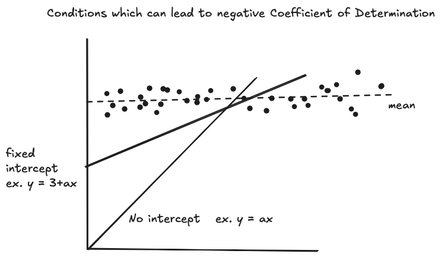

# Coefficient of Determination (R²)

**Definition**:
The **coefficient of determination**, denoted **R²**, measures the proportion of variance in the dependent variable explained by the model:

$$
R^2 = 1 - \frac{\text{RSS}}{\text{TSS}}
$$

Where:

* **RSS**: Residual Sum of Squares = $\sum (y_i - \hat{y}_i)^2$
* **TSS**: Total Sum of Squares = $\sum (y_i - \bar{y})^2$

## Algebraic Identity: TSS Decomposition

We can rewrite TSS using:

$$
TSS = \sum (y_i - \bar{y})^2 = \sum \left[ (y_i - \hat{y}_i) + (\hat{y}_i - \bar{y}) \right]^2
$$

Expanding the square:

$$
TSS = \sum (y_i - \hat{y}_i)^2 + 2 \sum (y_i - \hat{y}_i)(\hat{y}_i - \bar{y}) + \sum (\hat{y}_i - \bar{y})^2
$$

$$
\Rightarrow TSS = RSS + 2 \sum (y_i - \hat{y}_i)(\hat{y}_i - \bar{y}) + ESS
$$

## Linear Regression with Intercept

In **linear regression** (linear in parameters) **with an intercept**, the cross-term:

$$
2 \sum (y_i - \hat{y}_i)(\hat{y}_i - \bar{y}) = 0
$$

Thus:

$$
TSS = RSS + ESS \quad \Rightarrow \quad R^2 = \frac{ESS}{TSS}
$$

R² is always between 0 and 1

## Without Intercept

Without an intercept:

* The residuals are **not orthogonal** to fitted values.
* The cross-term **does not vanish**.
* $R^2$ can be **negative**, since RSS can exceed TSS.

---

## Nonlinear Regression

In **nonlinear regression** (nonlinear in parameters), even with an intercept:

* The cross-term may **not be zero**.
* Hence, $R^2 = 1 - \frac{RSS}{TSS}$ is not guaranteed to lie in $[0,1]$.
* **R² can be negative**, even for a model with an intercept.

## Relationship with Coefficient of Correlation (r)

In **linear regression**

$$
R^2 = r^2
$$

Where **r** is the **Pearson correlation coefficient** between the observed $y_i$ and predicted $\hat{y}_i$

$$
r= \rho(y, \hat{y}) = \frac{\operatorname{Cov}(y, \hat{y})}{\sigma_y \, \sigma_{\hat{y}}}
$$

* **r** measures **linear association** between dependant and independant  (can be negative or positive also it can be a misleading zero in case of non linear association)
* **R²** measures **proportion of variance explained** (always non-negative)

This identity holds **only in linear regression with intercept**. In:

* Nonlinear regression → R² ≠ r²

Although some places it is represented like this, in this case the original definition of $R^2 = 1 - \frac{RSS}{TSS}$ no longer holds it just the square of the correlation coefficent

---

**Conclusion**:

* $R^2 = \frac{ESS}{TSS}$ only when the model is **linear in parameters and includes an intercept**.
* In this case, $R^2 \in [0, 1]$.
* Otherwise (no intercept or nonlinear model), $R^2$ can be **negative** and may not reflect model fit accurately.
