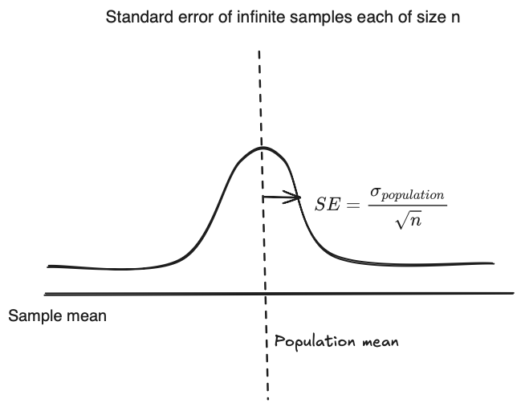
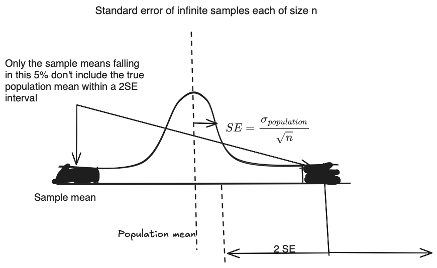

# Sampling and confidece intervals

Let us get some fundamentals that you face in reality first

- You don't know the population characterstics (mean, std etc.)
- You have only ONE sample/dataset not many
- Breaking up the sample and resampling will not reveal anything extra about the true population it will only give you the estimates of the characterstics of the sample which you already know.

We want the population mean but we can't just give the sample mean and be done with it, how to put some confidence intervals around it.

Suppose we could make infinite number of samples of size n from the real population then we have the Central limit theorem that says

- Given a set of sufficiently large samples drawn from the same population, the
means of the samples (the sample means) will be approximately normally distributed
- This normal distribution will have a mean close to the mean of the population
- The standard deviation of the sample means will be close to the standard deviation of the population divided by the root of sample size.

But unfortunately we can't make multiple samples we have only one sample/dataset but the last point is interesting

The SE for a sample of size n is the standard deviation of the means of an infinite number of samples of size n drawn from the same population. Unsurprisingly, it depends upon both n and σ, the standard deviation of the population:
$$ 𝑆𝐸 = \frac{\sigma}{\sqrt n} $$

If we don't have population standard deviation we use sample standard deviation instead to approximate it.

Suppose we want to reject something at the 95% confidence level what does that mean?

Looking at the below figure only 5% of the sample means with a 2 SE interval don't include the population mean

Now we only have one sample

We take one sample and calculate its mean and standard error (SE). Using that, we build a confidence interval around the sample mean.

If the population mean assumed by the **null hypothesis** falls *outside* this interval, we reject the null. Why? Because such an extreme sample mean would occur only about 5% of the time if the null hypothesis were actually true.

It’s important not to misinterpret the interval. Once we’ve calculated it, the population mean either **is** or **is not** in the interval — there’s no probability involved anymore as both are fixed.

The correct interpretation is this:

> If we repeated this sampling process many times, and built a confidence interval each time, about 95% of those intervals would contain the true population mean.

This is what a 95% confidence interval really means.

## Comparing two distributions

- When sampling from two **different populations** (e.g., `μ₁ = 119.5`, `μ₂ = 120`), the **null hypothesis (H₀: μ₁ = μ₂)** is **false**.

- If we repeatedly sample and perform a **t-test**, we may still get **p < 0.05 only \~11.6%** of the time (not 5%), because:

  > ⚠️ **The 5% significance level (α)** controls the **false positive rate when H₀ is true**, **not** the detection rate when H₀ is false.

- The chance of correctly rejecting a false H₀ is called **power**. Low power means few small p-values, even when H₀ is false.

### t-test construction

- From samples of size `n₁`, `n₂`, we compute:

$$
t = \frac{\bar{x}_1 - \bar{x}_2}{\sqrt{\frac{s_1^2}{n_1} + \frac{s_2^2}{n_2}}}
$$

- `s₁`, `s₂` = **sample standard deviations** (not population std devs)
- We use t test as real population std devs are unknown.

- This `t` is compared to the standard **t-distribution** (with estimated degrees of freedom) to get a **p-value**.

### Key Insight

> Even if populations differ, small sample sizes or high variability can lead to high p-values — not because H₀ is true, but because the **test isn't powerful enough** to detect the difference.

---

## References

1. Chapter 15 in INTRODUCTION TO COMPUTATION AND PROGRAMMING USING PYTHON by John Guttag
